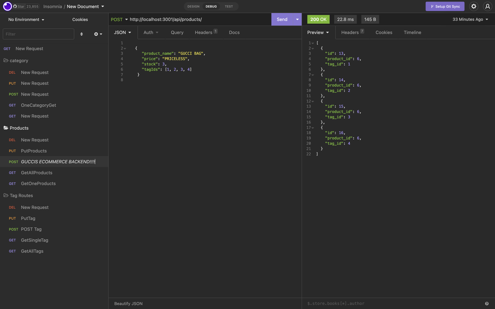

<!-- PROJECT LOGO -->
 

  

  <h1 align="center">Fabian's E-Commerce BackEnd!</h1>

<!-- ABOUT THE PROJECT -->
## About The Project

This Project is nick-named "The Amazon Slayer", and has Jeff Bezos shaking in his boots. While this might be a bit of over-exageration it's functionality is getting there! Keep track of all your inventory, by category, product or even tags!

[Click here for Walkthrough Video]("https://drive.google.com/file/d/1SRLFBRaYJRo9ZWkJqF-qORRb_DDS0DxA/view") 

(<a href="#readme-top">back to top</a>)

### Built With

### Installation

* Step 1: Clone repo
* Step 2: use "npm i" to install the packages required
* Step 3: npm install sequelize
* Step 4: npm install dotenv

(<a href="#readme-top">back to top</a>)

<!-- USAGE EXAMPLES -->
## Usage
Open up terminal, npm run seed, then npm start

(<a href="#readme-top">back to top</a>)

<!-- CONTRIBUTING -->
## Contributing

I am the only direct(instructors and tutor helped) contributer to this Repo.

(<a href="#readme-top">back to top</a>)

<!-- LICENSE -->
## License

(<a href="#readme-top">back to top</a>)

<!-- CONTACT -->
## Contact

Fabian Gutierrez - [fabiangutierrez580@gmail.com]
(LinkedIn) - [www.linkedin.com/in/fabian-gutierrez-016523248]

Project Link: [https://github.com/Guccierrez/EcommerceBackEnd]

<!-- ACKNOWLEDGMENTS -->
## Acknowledgments
Again shout out to My instructors, Mr. Edwards and Mr. Andrew.
